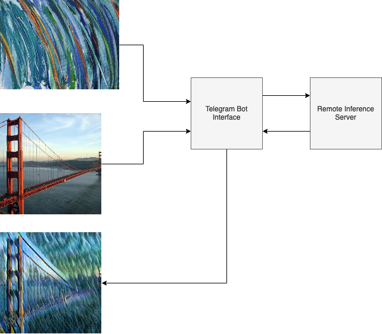

# Style Transfer Bot

This is a simple style transfer app with a telegram bot interface

### Architecture

- A torch model for style transfer is hosted on a remote server
- Requests are sent through a telegram bot with several dialogue options



### Used packages

- `fastapi` and `uvicorn` for serving
- `torch` and `torchvision` for neural network inference
- `Pillow` for image operations
- `pyTelegramBotAPI` for telegram bot

### Deployment

You can run a server using command `python3 -m style_transfer_app --token %specify token given by @BotFather%`

The bot can be tested here: https://t.me/MSU_style_transfer_bot \
Use ```/start``` to begin, then you can use the ```/stylize_content``` command. \
If you want to change a chosen style, use ```/choose_style```.

Requires ```python >= 3.9```

### Create distribution

You can create wheel and tar archive with tests and docs using the command ```python3 -m build```
